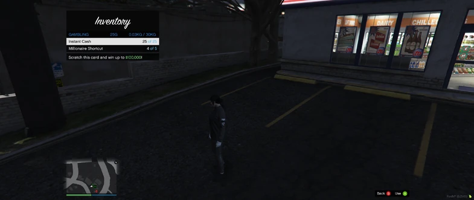

# Earning Bank: Strategies for Financial Growth

Enhancing your bank balance is a vital aspect of the game, offering you the resources needed to thrive and progress. Here are diversified ways to earn money, catering to different roles and play styles.

## Daily Check-In Reward

- **Time of Receipt**: Every in-game day at 12:00 PM (Noon).
- **Method**: Automatically deposited into your bank account.
- **Amount**: Varies depending on the role you are playing on the server.

## Role-Specific Tasks

### Criminals (Default Role)
- **Activities**: Engage in robbing AI pedestrians and shops, stealing cars for export or scrap, eliminating most wanted players for bounties, and hacking ATMs.

### Police Officers
- **Activities**: Earn through arresting players, accepting bribes, or neutralizing most wanted players.

### Paramedics
- **Activities**: Generate income by reviving and healing players.

### Drug Dealers
- **Activities**: Profit from selling drugs to other players.

## Lottery Tickets

- **Purchase Locations**: Available at LTD or 24/7 shops across the map, indicated as 'Gas Station' or 'Convenience Store'.
- **Gameplay Note**: Remember, lottery wins are based on chance, and success is not guaranteed.

  

### To Use a Lottery Card

1. Press `M` or the left circle button to access your inventory.
2. Navigate to the `Gambling` section.
3. Select the lottery card you wish to use.


**WARNING**: Gambling can be highly addictive. Engage responsibly and be aware of the risks involved.


